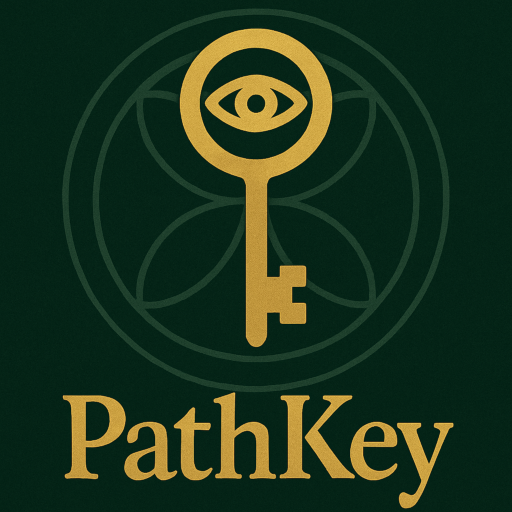

  

<h1 align="center">Path Key</h1>

  <strong>Unlock Your Path • Discover Your Purpose</strong> 
  <a href="https://mypathkey.com" target="_blank">mypathkey.com</a>

---

### 🌿 About Path Key

**Path Key** is a modern numerology and self-discovery platform designed to help you understand your unique path through data-driven insights and intuitive design.  
Rooted in precision, symbolism, and technology, Path Key translates complex numerological calculations into clear, actionable guidance.

Built with a focus on **privacy, performance, and personal growth**, Path Key blends mathematical systems with an elegant interface to empower conscious living.

---

### 💻 Cross-Platform Availability

Path Key will soon be available across all major platforms:

- 🌐 **Web** — accessible anywhere via [mypathkey.com](https://mypathkey.com)  
- 🪟 **Windows** — native desktop app for streamlined experience  
- 🍎 **macOS** — optimized for Apple Silicon and Intel  
- 🐧 **Linux** — lightweight, open-standard desktop integration  
- 🤖 **Android** — mobile companion for daily insights  
- 📱 **iOS / iPadOS** — elegant and intuitive mobile design  

Stay tuned for official release announcements and beta access.

---

### ⚙️ Core Technologies

- **Path Key Engine** — a proprietary numerology computation engine written by *Nick Chiaravalle* and licensed exclusively to Path Key (*Anthony M. Lenk*).  
- **Web UI Shell** — portable, responsive console-style interface connecting users to the Path Key Engine via secure APIs.  
- **Cross-Platform Apps** — unified design language built using modern frameworks optimized for accessibility and speed.

---

### 🛡️ License

This repository and all related software are protected under the **Path Key Proprietary License**.  
Unauthorized reproduction, modification, or distribution is strictly prohibited.

For licensing or partnership inquiries, please contact:

- **Anthony M. Lenk** — Owner, Path Key  
  ✉️ nfboxer2010@gmail.com  

- **Nick Chiaravalle** — Author, Path Key Engine  
  ✉️ chirv@oxy2k.org

---

### 🌠 Connect

- 🌐 **Website:** [mypathkey.com](https://mypathkey.com)  
- 🧭 **Coming Soon:** App downloads and early access portal  
- 📬 **Inquiries:** via official website contact form or email above  

---

  © 2025 Path Key. All Rights Reserved.

